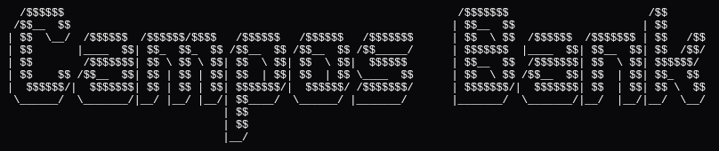

<div align="center">
  
</div>

<p align="center">
  
  
</p>

## 📖 Sobre o Projeto

O **Campos Bank** é um projeto fictício e autoral desenvolvido por **Danilo Campos** para consolidar os conhecimentos do segundo módulo do bootcamp **Riachuelo - Primeiros Passos com Java** da **DIO**.

O foco principal foi a aplicação prática da linguagem *Java* e de conceitos de **Arquitetura de Software** e **Programação Orientada a Objetos (POO)**.

### Tecnologias e Conceitos Implementados:

- **Linguagem:** Java 21
- **Gerenciador de Dependências:** Maven
- **Arquitetura & Padrões:**
    - Padrão **MVC** (Model-View-Controller).
    - Padrão **Repository**.
    - Padrão **Strategy**.
    - Princípios **SOLID**.

---

## 🚀 Funcionalidades

O sistema simula um ecossistema bancário via terminal, permitindo:

* Cadastrar e acessar contas bancárias;
* Realizar transferências PIX entre contas;
* Sacar e depositar quantias;
* Realizar investimentos e resgatar rendimentos;
* Gerar extrato bancário.

---

## 🎨 Experiência do Usuário (UX)

Embora seja uma aplicação CLI (Command Line Interface), houve uma atenção especial à interface para garantir uma boa experiência ao usuário:

* Visualizações por tabelas;
* Validação de dados com avisos e tratativa;
* Menus organizados;
* Fluxo de experiência organizada.

---

## 🛠️ Como Executar

```bash
# Clone o repositório
git clone https://github.com/danilocamposdev/campos-bank.git

# Entre na pasta
cd campos-bank

# Compile e rode via Maven
mvn clean compile exec:java -Dexec.mainClass="com.camposbank.Main"
```

